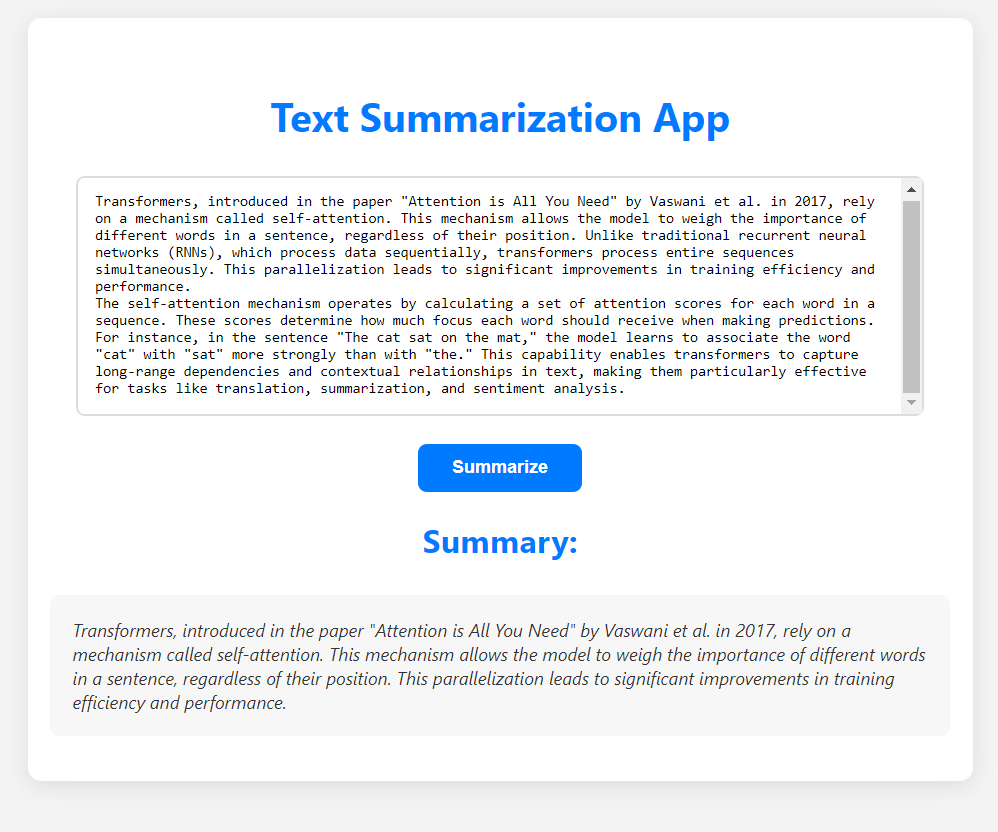

# Text Summarization App

Summarization involves producing a condensed version of a document or article that retains the key information. There are two main types of summarization:

- **Extractive**: Selecting and extracting the most important details directly from the text.
- **Abstractive**: Generating new text that conveys the essential information in a more concise form.

In this project we will:

- Fine-tune the T5 model on a subset of the BillSum dataset containing California state bills for abstractive summarization.
- Run inference using our fine-tuned model.

## Example



The **Text Summarization App** is a web application designed to generate concise summaries of lengthy texts. Utilizing advanced natural language processing techniques, this app simplifies content, making it easier for users to grasp essential information quickly. The project leverages the T5 model for abstractive summarization, providing efficient and accurate results.

## Features

- User-friendly interface for inputting text.
- Generates summaries with just one click.
- Built with Flask for the backend and HTML/CSS/JavaScript for the frontend.

## Technologies Used

- **Frontend**: HTML, CSS, JavaScript
- **Backend**: Flask
- **Model**: T5 for text summarization
- **Environment**: Python 3.10, pip, or conda for package management

## Installation

### Prerequisites

- Python 3.10 or higher
- pip (or conda)

### Clone the Repository

```bash
git clone https://github.com/afanys117/text-summarization-app.git
cd text-summarization-app
```

### Install Requirements

1. Create a virtual environment (optional but recommended):

   ```bash
   python -m venv venv
   source venv/bin/activate  # On macOS/Linux
   venv\Scripts\activate     # On Windows
   ```

2. Install the required packages:

   ```bash
   pip install -r requirements.txt
   ```

## Running the App

1. Ensure you are in the project directory.
2. Run the Flask app:

   ```bash
   python app.py
   ```

3. Open your web browser and go to [http://127.0.0.1:5000](http://127.0.0.1:5000).

## Usage

1. Input your text into the provided text area.
2. Click on the **Summarize** button.
3. The summary will be displayed in the designated section below the input box.
